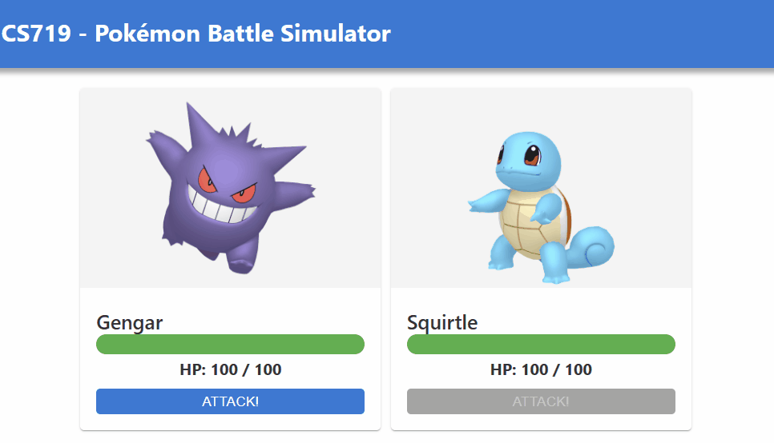
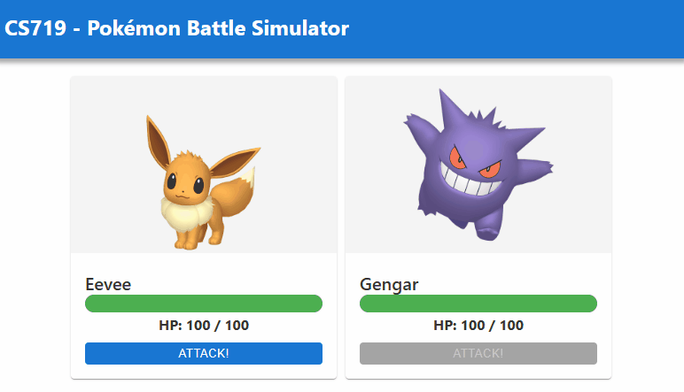
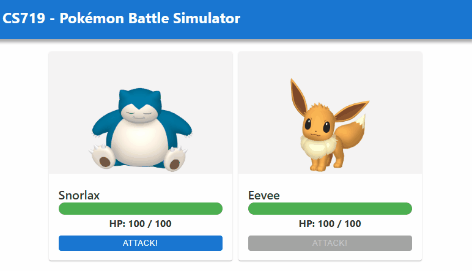

# COMPSCI 719 Assignment - A Pokémon Battle Simulator

In this assignment, you will build a simple Svelte application designed to simulate a battle between two random Pokémon. The end product will look something like this (depending on your own personal CSS styles):

<div style="display: flex; flex-direction: column; align-items: center">



_Example of a completed assignment._

</div>

The assignment will assess your knowledge of the following concepts:

1. Git / GitHub
2. HTML
3. CSS
4. Client-side JavaScript
5. Svelte components and props
6. Svelte component styling
7. Svelte stores

> [!NOTE]
> This assignment also includes tasks which requires you to use research skills on documentation online. This will give you the opportunity to research and apply additional techniques related to animation, such as CSS `@keyframes`, transitions, positioning, and JavaScript timers (i.e. `setTimeout()`).

A very limited amount of source code has been provided to you as a starting point. We highly suggest that you do the following as soon as you clone this repo onto your machine:

1. Read this README!
2. Install dependencies `npm install`
3. Run the existing app `npm run dev`
4. Examine the existing codebase to gain an understanding.

Once you're ready, dive into the steps below. This assignment is marked out of **100** marks. The marks for each step are given below.

You will need to modify sections of this README.md file with your answers, look for areas marked with _(TODO ...)_, please fill these in and commit to Git as you normally would with code.

## Step 0 - Git

As part of this assignment, it is expected that you make proper use of git and git commits. You are expected to make **at least one git commit for each of the steps below**. In each of the steps, there is a space for you to write the git _commit message_ corresponding to the completion of that step, so the markers can easily verify that you have done this (though you are more than welcome - and highly encouraged - to make more git commits than this, if you wish). Git commit messages should be _informative_ - they should clearly explain what the commit is about.

**Failure to make a git commit for a given step will result in a 50% penalty for the marks for that step. There will be no exceptions to this rule.**

## Step 1 - Basic layout and styling _(30 marks for code, 5 marks for written section - 35 marks total)_

For the first step, build up your user interface using Svelte components which you create. The UI should show two Pokémon, along with their HP, and each should have an "Attack" button.

The exact styling and layout you use is entirely up to you, as long as it meets the following requirements:

0. Run the project and see what the output looks like in Chrome. Then briefly look through the code files, including `+page.svelte`.
1. A page header should be displayed containing the text "CS719 - Pokémon Battle Simulator". It should stand out from the background in some way.

2. Read through the Pokémon data code in `src/lib/js`, understand what the Pokémon array data structure looks like in `pokedex.js`, how it is imported into
   `battle-store.js`, and how it finally is rendered in html in `src/routes/+page.svelte`.

   - You should identify inside `battle-store.js` that the function return `getTwoRandomPokemon()` is the initial value of `$battleStore`. In particular you should try to answer the question; how many Pokémon are inside `$battleStore` at the start? (Answer: 2, and not random for now...)

3. `$battleStore`, imported into `+page.svelte`, contains an array of Pokémon. Each Pokémon has a `dexNumber`, `name`, `hp`, `maxHp`, `imageUrl`, and `canAttack` status (true or false). Your app should loop through and display each of these Pokémon, consider the Svelte `{#each arrayVal as itemVal}` block syntax.

4. Convert the `#each` block from the previous step into a keyed `#each` block. Read this documentation to learn about them and understand the difference in the code demo <https://learn.svelte.dev/tutorial/keyed-each-blocks>. After reading through the documentation on keyed each blocks, you should use `dexNumber` as a [key] in your `#each` block.

   - Apply the keyed `#each` block to your code. You must complete this step for your Pokémon to function as expected.

5. For each Pokémon, its `name`, current `hp`, `maxHp`, and image should be displayed.

6. The Pokémon should be displayed side-by-side on larger screens, or vertically on screens smaller than `600px` in width.

7. Create a Pokémon component with a meaningful name inside `src/lib/components`. The component should accept a prop or multiple props (`export let...`) that represent the data for a single Pokémon. Update your `#each` loop in `page.svelte` to use your new Pokémon component, remember to import the Pokémon component using `$lib/...` pathing.

8. An "Attack" button should also be displayed for each Pokémon. Add an button to your component.

9. Apply CSS to the button to make a custom button, which looks different depending on whether it is "normal", `:disabled`, `:focus`, or `:active` (clicked).

10. An HP bar should be displayed to visualize a Pokémon's HP. For now, the HP bar should always show 100% full health, however keep in mind you will complete the functionality of the HP bar to show other values <100% in a later step. You may wish to create a dedicated component for the HP Bar.

11. The button should be `disabled` if the corresponding Pokémon has `canAttack` set to `false`.

12. Apply CSS to each Pokémon's display area to make it stand out from the background.

An example of what this might look like is shown here (but the exact styling and color scheme are up to you as long as it meets the requirements above):

<div style="display: flex; flex-direction: column; align-items: center">


_Pokémon battle sim, on a desktop browser_


_Pokémon battle sim, on a mobile browser_

</div>

**Note:** Do **not** just put all your HTML & CSS into `+page.svelte`! Consider how you might decompose into one or more svelte components.

### Written section: Svelte components

In this section, write down how you have broken up your UI into different Svelte components, and why you chose that particular decomposition.

<b> comments: I have broken down the UI into 2 extra components, being, HealthBar.svelte and PokemonOperation.svelte. The reason for this is due to the fact that the values within these components will undergo several modifications throughout the program,therefore, it is good practice to seperate the operation in components instead of writing all the code in one file. 

For some aspects such as the images, their styling was not needed to be in seperate components as their styles are set throughout the program and wont undergo any changes. However, for aspects such as the health bar, and current health of pokemon, those aspects needed to be seperate as they will undergo extensive changes throughout the program </b> 

### Git commit message

Once you've completed Step 1, remember to make a git commit! Write down the git commit message you've used to represent the final commit of step 1:

<b>git commit message for step 1:  Completion of step 1 (Setting up UI components and styling) (some aspects might change) </b>

## Step 2: Game logic _(30 marks total, see mark breakdown below)_

In this step, you will write the game logic. This will occur mainly within the file [`battle-store.js`](./src/lib/js/battle-store.js), but will also require you to handle when the user clicks on your "Attack" buttons you created in Step 1.

Currently, this file contains a writable Svelte store called `battleStore`, which we export (and you probably used using `$battleStore` in the previous step). This store is initialized with an array of two Pokémon, from the `getTwoRandomPokemon()` function. The file also exports a function called `attack()`, which currently does nothing other than `return` early if the `attacker` isn't able to attack.

### Complete `getTwoRandomPokemon()` _(5 marks)_

Currently this function always returns the first two Pokémon in the `pokedex` array (Bulbasaur and Charmander). Modify the function so that it instead returns two random, _different_, Pokémon.

Once complete, you should see a different pair of Pokémon show up each time you refresh the page.

### Call the `attack()` function appropriately _(10 marks)_

Whenever the user clicks one of your "Attack" buttons, this should result in the `attack()` function being called, with the `attacker` arg set to the Pokémon whose "Attack" button was clicked, and its `defender` arg set to the other Pokémon. There are many ways to achieve this; we recommend something similar to the following:

1. Assuming each Pokémon is displayed in its own Svelte component, raise a custom event from that component whenever its "Attack" button is clicked. That event should contain the `pokemon` corresponding to that component.

2. Handle this event from `+page.svelte`. The custom event's `detail` prop will contain info about the attacking Pokémon, while the defending Pokémon can be obtained using the JavaScript array `find()` function (i.e. "Find me a Pokémon in this array whose `dexNumber` is not equal to the attacking Pokémon's `dexNumber`").

3. Import the `attack` function from `battle-store.js` into `+page.svelte` so you can call it there. Call it from your event handling code above, passing in the `attacker` and `defender` appropriately.

4. Within the `attack()` function, log the `attacker` and `defender` to the console, for testing purposes.

### Implement the battle logic in the `attack()` function _(15 marks)_

The battle logic should be implemented as follows:

1. **Calculate max damage to inflict:** This should be a random integer between 10 and 20.

2. **Apply critical hit:** With a _10% chance_, the damage should be a _critical hit_. in this case, the max damage should be set to **40**.

3. **Calculate actual damage to inflict:** The actual damage should be either the defending Pokémon's remaining `hp` or the previously calculated max damage, whichever is lower.

4. **Apply damage:** Subtract the damage from the defending Pokémon's `hp`.

5. **Switch turns:** The attacker's `canAttack` status should be set to `false`. The defender's `canAttack` status should be set to `true`, but only if its `hp` is greater than 0.

**Hints:**

- Remember that once you've updated your game state, you'll need to make the Svelte store notifies its subscribers. The best way to do this within `battle-store.js` is to use `battleStore`'s `update()` or `set()` functions. You can use it like in this example, putting your battle logic in the given location. This will ensure that subscribers are notified correctly:

```js
battleStore.update((battlers) => {
  // TODO Your code here

  return battlers;
});
```

- Feel free to write one or more JavaScript functions to help you with this step - you don't need to put all the code into the `attack()` function. It could be nicer to break up the code into multiple functions - for example, one for calculating damage, another for applying damage, another for switching turns.

Once you've completed this step, your app should function similarly to the gif below:

<div style="display: flex; flex-direction: column; align-items: center">



_Example showing the UI successfully updating when an "Attack" button is clicked._

</div>

### Git commit message

Once you've completed Step 2, remember to make a git commit! Write down the git commit message you've used to represent the final commit of step 2:

<b>Final commit message: completion of Step 2, where the game logic was set up (Pokemon take turns attacking, attack values are genrated and they will effect the display of the currentHp of pokemon.) </b>

## Step 3: Functional HP bar _(15 marks)_

For this step, modify your HP bar so that it properly displays the proportion of remaining HP. In addition, the color of the HP bar, and the HP text, should change if the Pokémon's HP is below 20%.

After completing this step, your app should function similarly to the gif below:

<div style="display: flex; flex-direction: column; align-items: center">



_Example showing the HP bar changing, and a color change when below 20% HP._

</div>

### Git commit message

Once you've completed Step 3, remember to make a git commit! Write down the git commit message you've used to represent the final commit of step 3:

<b>Final commit for step 3: Completion of step 3. functional HP bar. (Made HP bar change based on percentage of current health, and had it change colour after current health reaches 20%) </b>

## Step 4: Fancy battle animations! _(15 marks for animations, 5 marks for written section - 20 marks total)_

For the final step, add some animations to a Pokémon whenever they take damage. In addition, display a visual indicator on a Pokémon whenever they "win" the battle - that is, whenever their opponent's HP drops to 0.

**Note:** This step is considered a _challenge_ step, and may require you to research further CSS, JavaScript and Svelte techniques not explicitly taught in the course.

An example of the kinds of animations and victory indicator you could add can be seen in the gif below:

<div style="display: flex; flex-direction: column; align-items: center">


_Example of a completed assignment._

</div>

In the example gif, we can see that, when a Pokémon is attacked, their HP bar drops smoothly, rather than instantly. In addition, an outline appears around the HP bar while their HP is dropping. Finally, the amount of damage inflicted appears on the right-hand side of the HP bar, and gradually floats up (with the words "Critical Hit!" appearing instead, if it was a critical hit).

In addition to the damage animation, we can see that an image of a crown appears next to the winning Pokémon.

To achieve these effects, the model solution uses a combination of the following:

1. [CSS transitions](https://developer.mozilla.org/en-US/docs/Web/CSS/CSS_transitions/Using_CSS_transitions)
2. [CSS positioning](https://developer.mozilla.org/en-US/docs/Web/CSS/position)
3. [CSS animations (`@keyframes`)](https://developer.mozilla.org/en-US/docs/Web/CSS/CSS_animations/Using_CSS_animations)
4. [JavaScript timers (`setTimeout()`)](https://developer.mozilla.org/en-US/docs/Web/API/setTimeout)
5. Adding additional information to the `pokemon` objects when damage is calculated (e.g. adding info to the defender about how much damage they took and whether or not it was a critical hit; adding info to the attacker about whether they won the battle).

Your animation - or combination of animations - must use **at least three** of the above techniques (but may also use other techniques not mentioned here if you wish).

**Remember:** You _don't_ have to try and implement exactly the same animation as shown here - use your imagination 😊

### Written section: Design decisions

In the space below, write an explanation detailing _what_ animations you implemented in this step, _how_ you achieved those animations, and _why_ you chose to do it that way.


<b> Animations implemented: css transitions. 
 How? : via editing the style component of the class for the inner div which is responsible for the colour of  the progress bar. The implementation made it so, any changes in the width and rotation (which would occur when the HP bar is reduced) to be displayed.

Why? : because the animations looked smooth and was simple in implementation, and it allows a better visual presentation of the HP bar decreasing 

 Animation implemented: keyframes

How? : Via created an @keyframe and setting it to shake identifier, inside this, the animation starts at 0% and finishes at 100%, inside each percentage , transform means a change in the component the keyframe will be applied to , the translate will indicate x axis movement and the rotate will indicate rotation around the center, essentialy imitating a "shake". The keyframe was implemented in the style component for images, and the duration of the animation was set to 2 s. 

 Why?: In order to mimic pokemon coming out of their pokeballs when the page loads.The translate component alternated between 2 px movement to the right, 2 px movementupwords, then back to base followed by 2px movements but the oppisite directions while the rotate alternated clockwise and anti clockwise rotations, both in order to mimic the shake animation.

 Animation implemented: css positioning 

 How?: It was implemented by adding position:absolute to the child div class of winner as well as adding position: relative; to it's parrent class, in order to ensure the positioning of the child div be within the bounds of the parent class.
 
  Why?: This was done in order to ensure the winning visual indication does not appear at the bottom of the parent class and instead appear at the top where there is more space ensuring symmetry between the two pokemon components  </b>

### Git commit message

Once you've completed Step 3, remember to make a git commit! Write down the git commit message you've used to represent the final commit of step 3:

<b> Final commit message for step 4: Completion of step 4, setting up visual indicator for winning pokemon and animations(where animations were set for HP bar decrease, pokemon appearance and visual indicator for winning pokemon)</b>
